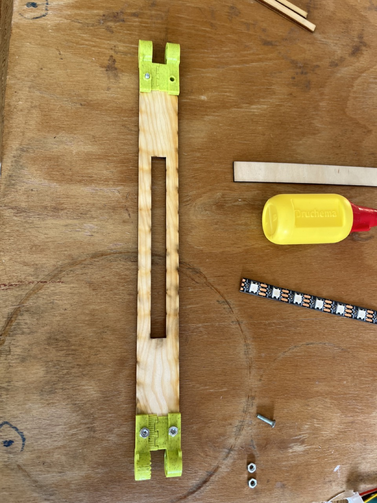
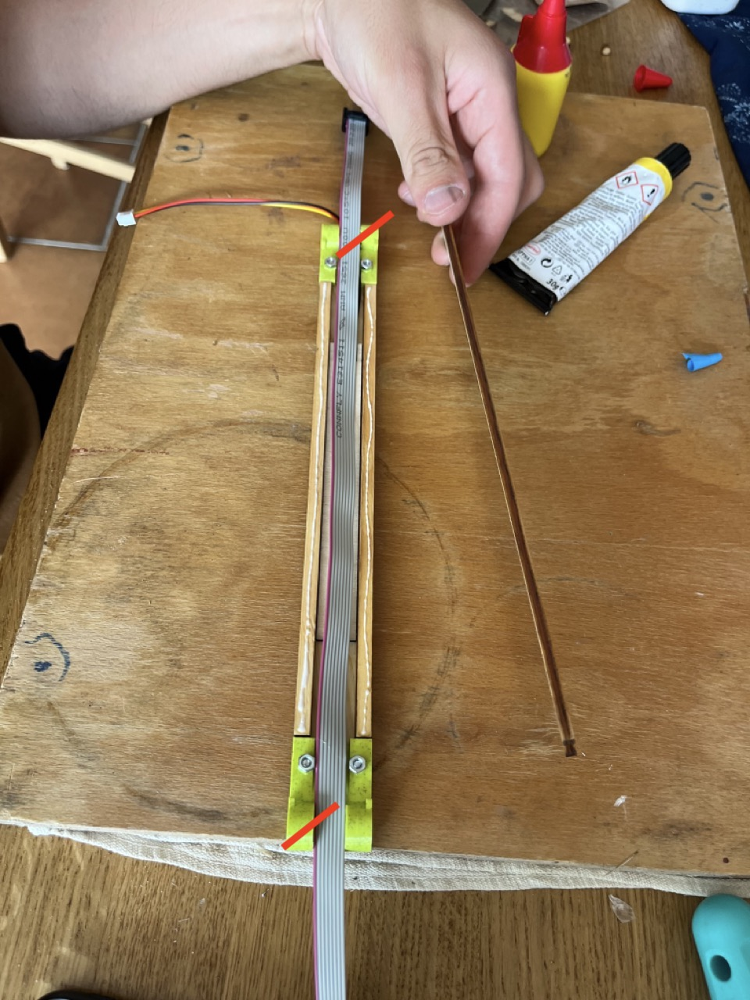
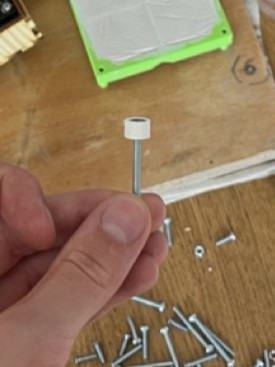
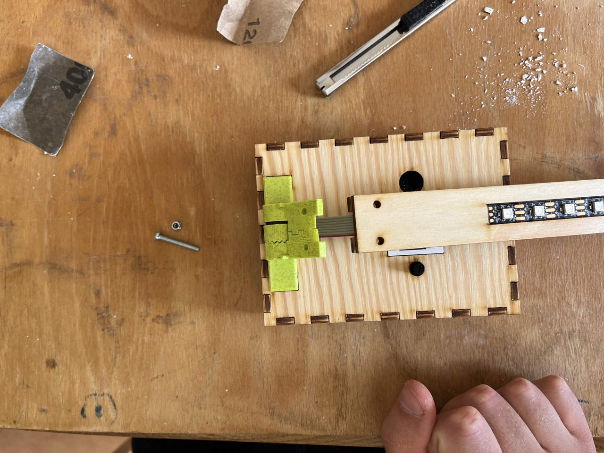
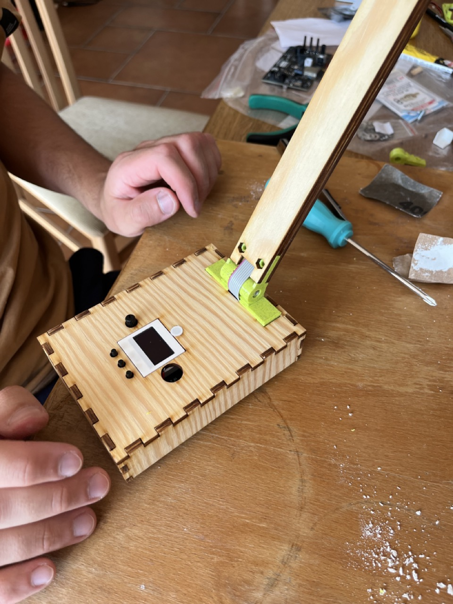
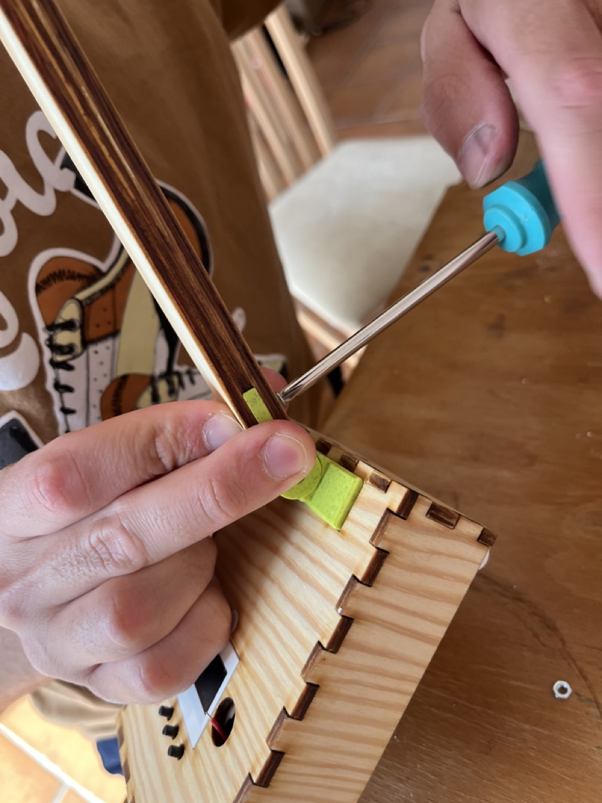
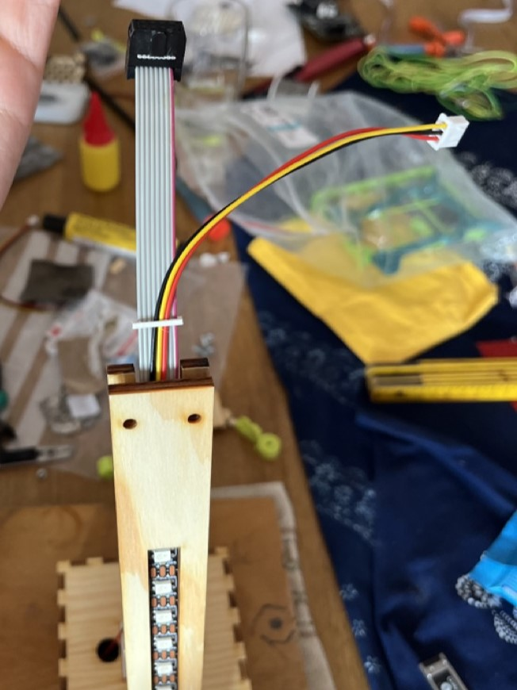
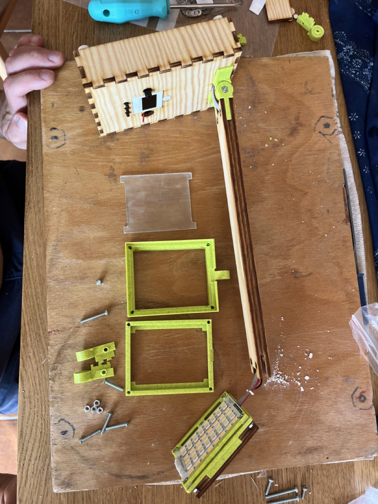
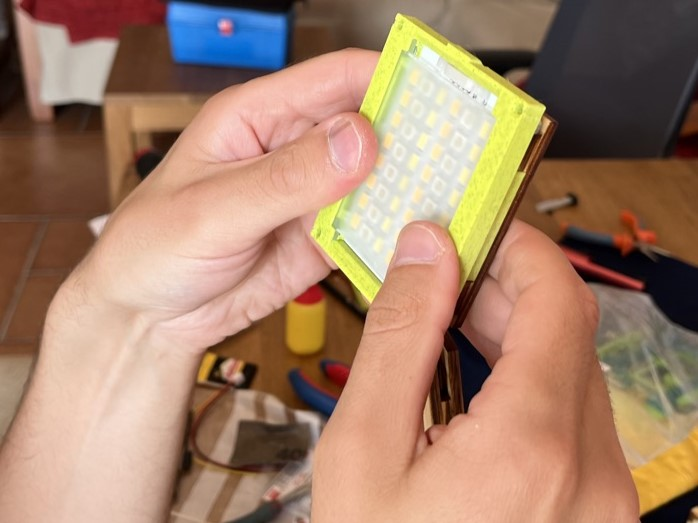
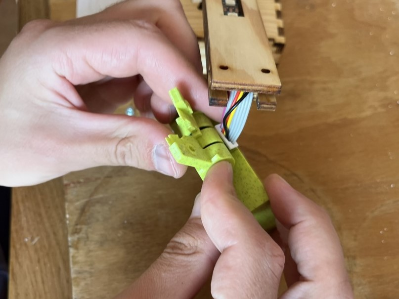

Tento dokument je návodem k sestavení mechanické části PaLampy. Hlavními postupy jsou lepení disperzním lepidlem (Herkules) a spojování šrouby.
Lepení dílů je mnohdy nevratný postup! Pokud si před zalepením dílu nejste něčím jistí, je dobré si to buďto vyzkoušet ještě před nanesením lepidla a nebo zavolat vedoucího, který vám poradí. 

Používaná lepidla a jejich vlastnosti
* **Herkules** - disperzní vodou ředitelné lepidlo na dřevo. Doba zasychání záleží na objemu naneseného lepidla, obecně platí, že pomocí tečkování aplikátorem ho naneseme takové množství, aby moc nebo vůbec nevytékalo z lepeného spoje po jeho zmáčknutí. Nanášíme pouze na jednu lepenou plochu a tečky můžeme poté špičkou lepidla rozetřít do plochy.
* **Lepidlo na plasty** - slouží pro upevnění matek ve slotových dírách. Sloty jsou udělané tak, aby se v nich matka nemohla protočit, lepidlo má pouze zafixovat matku, aby celá nevypadla. Nejlepší je tedy nanést malé množství lepidla na hranu matky (nezanášet lepidlem závit) a matku poté zatlačit až na doraz do slotu.

Při práci je důležité mít pořád čisté ruce a pracovní podložku, abyste si dřevo neumazali.
K lakování jsme vybrali polyurethanový lak, který je ředitelný vodou. Pro dobrý výsledek stačí nanést tenkou vrstvu laku na ohlazený a očištěný povrch tak, aby byla pokrytá celá lakovaná plocha (poznáte po naklonění plochy proti světlu). Nanáší se dvě vrstvy, to je v návodu popsáno.

**Pohledové plochy** poznáte tak, že je okolo okrajů lehká rovnoměrná stopa po ožehu a má světle hnědou barvu. Druhá strana není pohledová a obsahuje po obvodu tmavě hnědé nebo černé stopy. 

___
# Obsah
* [Vylití podstavy sádrou](#sadra)
* [Příprava plexiskla](#plexisklo)
* [Příprava překližkových dílů](#preklizka)
* [Sestavení krku](#krk)
* [Slepení krabičky](#krabice)
* [Sestavení části s hexagony](#CastSHexagony)
* [Sestavení podstavy](#spodek)
* [Sestavení kloubů](#klouby)
___

<!-- _________________________________________________________________ -->
# <a name = sadra>Vylití podstavy sádrou</a>

## Potřebujeme:
* Spodní díl krabice
* Ohrádku na sádru
* Sádru
* Vodu
* Sádrovací misku
* Špachtli
* Igelitový sáček
* 4 šrouby M3x30 + matky 

## Postup:
Ukliďte si pracovní plochu po předchozích krocích, tj. odstraňte pájku, příslušenství k pájení a zbytky po něm.
Odlévání sádry nedělejte sami. Proveďte to po skupinách pod dozorem vedoucího.

*Připravte si dopředu všechny díly a potřeby. Pokud si je nepřipravíte předem, budete je hledat, když bude sádra tuhnout a místo odlitku budete mít nekompatibilní sádrový talířek.*

Protáhněte šroub jednou dírou v rohu dřeva. Igelit propíchněte šroubem.

Na šroub dejte ohrádku na sádru tak, jak vidíte na obrázku. 

Našroubujte matku, zcela neutahujte.

Než budete propichovat igleit dalšími šrouby, natáhněte jej. Obdobným způsobem provlečte ostatní tři šrouby. Celá plocha igelitu by měla být přiměřeně napnutá.

Na šrouby nasaďte matky a utáhněte je.

Rozmíchejte sádru s vodou do mírně řidší konzistence. 

Sádru vylejte do připravené vaničky. Hladina sádry by měla být jeden až dva milimetry pod úrovní ohrádky. 

Pro lepší rozlití sádry ve vaničce můžete s odlévaným dílem lehce zatřást nebo lehce klepat o nějaký povrch. 

Výsledný díl vylitý sádrou by měl vypadat přibližně takto:

Nechte sádru zatuhnout a mezitím připravte plexisklo podle dalšího kroku.

<!-- _________________________________________________________________ -->
# <a name = plexisklo>Příprava plexiskla</a>

## Potřebujeme:
* díl z plexiskla
* Hrubý smirek (hnědý - 240)
* Jemný smirek (černý - 600)
* Brusná pasta 
* Papírová utěrka

## Postup:
Z plexiskla odstraňte krycí fólie. 

Hrubým smirkem lehce zaoblete hrany dílu z plexiskla. 

Nyní krouživým pohybem hrubým smirkem zdrsněte průhlednou plochu plexiskla z obou stran.  

Stejný postup proveďte s jemným smirkem (600).

Výsledný povrch plexiskla by měl vypadat následovně:

Nyní plexisklo položte na papírový ubrousek. To je důležité kvůli tomu, aby při leštění nedošlo k jeho poškrábání nečistotami!

Na vrchní stranu plexiskla dřívkem naneste malé množství brusné pasty z kelímku. 

Druhým ubrouskem brusnou pastu krouživými pohyby roztírejte po povrchu plexiskla, čímž dojde k jeho vyleštění. 

Stejný postup opakujte i pro druhou stranu plexiskla. Po dokončení leštění díl umyjte. 

<!-- _________________________________________________________________ -->
# <a name = preklizka>Příprava překližkových dílů</a>

## Potřebujeme:
* všechny díly z překližky 
* Hrubý smirek (žlutý - 240)
* Jemný smirek (černý - 600)

## Postup:
Ukliďte si do čista pracovní plochu. Jakékoli zbytky sádry nebo jiného nepořádku zašpiní překližku.

Pokud dřevo stále obsahuje nějaké části, které měly po vyřezání laserem vypadnout, odstraňte je tak, že je vytlačíte ven. Vytlačte je směrem k nepohledové pološe. 

Pokud dřevo obsahuje nějaké otřepy a zbytky po vytlačení odpadních částí, odstaňte je buďto rukou, nožem nebo hrubým (žlutým) smirkem. Ten můžete kvůli tomu přehnout, ale přehněte pouze část u kraje. Dále podle obrázku níže zkoste nožem hranu asi do 1,5 cm od okraje, a to na obou stranách. 

Obruste smirkem pohledové plochy překližky. Přeburuste plochu nejdříve hrubým smirkem (žlutým) a potom ji dohlaďte jemným (černým) smirkem. Většinou je plocha už od začátku v pořádku, takže není potřeba moc brousit, stačí pouze mírně obrousit lehce opálené okraje pohledové strany.

<!-- _________________________________________________________________ -->

# <a name = krk>Sestavení krku</a>

Ukliďte si pracovní plochu po předchozích krocích, tj. setřete prach vzniklý broušením (nejlépe mokrou hadrou nebo kapesníkem).

## Potřebujeme: 
* Děravý a neděravý díl krku
* 2 díly na bok krku (úzké dlouhé tyčky)
* LED pásek s napájenými přívodními drátky
* Tenký dřevěný díl na oporu LED pásku
* 4 díly kloubů
* Herkules
* Tavná pistole
* Nůž
* 4 šrouby M3x12 se zápustnou hlavou + matky

 

## Postup:
Na nepohledové straně dílu v místě naznačeném na obrázku seřízněte nožem vnitřní hranu. Jedná se o hranu směrem k plastovému kloubu s kulatými okraji (bez zoubků).

Od této chvíle je potřeba dávat pozor, aby byl výřez na vrchní straně krku. V dalších krocích budou výřezem protaženy kabely k LED pásku, které musí vést shora. 

Sestavte vždy 2 a 2 díly kloubů dohromady podle obrázku níže. Později je vyndáte, takže nemusíte přemýšlet, jaká dvojice přijde kam. 

Přišroubujte klouby k děravému dílu krku na obou stranách. Matky dejte tak, aby kopírovaly natočení, které je vystouplé z dílu.

Zkusmo přiložíte neděravý díl krku, matky do něj musí padnout na obou stranách. 

Díl zase odstraňte.

Na jednu stranu úzké tyčky naneste lepidlo. 

K dílu s otvorem přilepte první úzkou dlouhou tyčku tak, aby bok tyčky byl souběžný s bokem podkladového dílu.

Stejným způsobem přilepte druhou tyčku. 

Na okraje tenkého podpůrného dílu naneste lepilo podle následujícího obrázku a do otvoru vložte LED pásek tak, aby jeho kabely směřovaly směrem k vytvořenému výřezu. Pozor, kabely LED pásku směřují k plastovému kloubu s kulatými okraji (bez zoubků), ne tak jako na obrázku (křížek) i dalších obrázcích.

Podpůrný díl přilepte do drážky podle obrázku níže. Výřez v podpůrném dílu přisuňte k hraně s kabelem. 

Po zaschnutí lepidla na podpůrném dílu odlepte krycí fólii na zadní straně LED pásku. 

LED pásek nalepte na podpůrný díl podle obrázku:

Pod vystupující kabely LED pásku naneste kapku z tavné pistole. Kabely do ní vmáčkněte:

Nechte zchládnout.

Do vzniklého prostoru vložte plochý kabel. **POZOR! orientace kabelu musí být přesně taková, jako je na obrázku.** Zkontrolujte si, že máte na stejné pozici červený pás na kabelu i stejně orientované konektory.

V horní části dílu s otvory pro matky udělejte z vnitřní (nepohledové) strany výřez pro vyvedení kabelů: 

Naneste lepidlo na úzké části:

Přilepte poslední díl krku.

<!-- _________________________________________________________________ -->
# <a name = krabice>Slepení krabičky</a>

## Potřebujeme:
* Všechny díly krabice kromě spodního
* Lepidlo Herkules
* Papírová páska

## Dobrá rada pro lepení:
Nanášejte vždy odpovídající množství lepidla. 

Pokud vám lepidlo po stlačení dílů vyteče na pohledové hraně, otřete ho papírovým ubrouskem směrem ven z krabice, nikdy směrem dovnitř.

## Postup:
Slepte "ohrádku" ze zadní, přední, levé a pravé stěny krabičky. Zalepte první spoj, lepidlo naneste na všechny plochy, které se spojí. Slepený spoj poté stáhněte kusem papírové pásky o délce cca 5 cm. Pro držení tvaru je možné použít horní díl, zatím ho nelepte. Dávejte pozor, abyste správně nalepili díl, kde je díra na USB konektor (viz fotky níže).

Stejně slepte i další rohy.

Před přilepením horního dílu se ujistěte, že je správně otočený - široká členitá díra má být u té strany krabice, kde je díra na USB konektor.

Přilepený díl zajistěte na cca 4 místech páskou. Ujistěte se, že nejsou nikde mezery mezi díly. Pokud ano, vedoucí vám pomůže.

Případné nedořezy ve členitém otvoru spravte pomocí nože nebo hrubého (žlutého) brusného papíru. 

Zkuste do otvoru vsadit tištěný díl s pantem podle obrázku:

Pokud je možné bez problémů díl vsunout do krabičky, můžete pokračovat k dalšímu kroku.

<!-- _________________________________________________________________ -->
# <a name = CastSHexagony>Sestavení části s hexagony</a>

## Potřebujeme:
* Překližka s šestiúhleníkovými výřezy
* 4 rohové díly s šestihrannými otvory
* 4 rohové díly s kruhovými otvory
* Jemný brusný papír (černý)
* Lepilo Herkules
* 2 tooly na lepení rohových dílů

## Postup: 
Dřevo s šestiúhleníkovými výřezy položte pohledovou stranou dolů. S pomocí tištěného toolu přilepte do rohu desky dílek s šestiúhleníkovým otvorem na matku. Všechny hrany musí být v jedné rovině, jinak je nebude možné později vsadit do tištěného dílu. 

Dávejte pozor na pořadí lepených dílů, na velkou obdélníkovou část musí být přilepený díl, který má výřez na matku. 

Po zaschnutí lepidla na tento dílek přilepte rohový díl s kruhovým otvorem pro šroub, jak je ukázáno na obrázku:

Stejným způsobem přilepte i dílky ve zbývajících rozích. Výsledek:

<!-- _________________________________________________________________ -->
# <a name = lak1>Nanesení první vrstvy laku</a>

## Potřebujeme:
* Slepená krabička
* Spodní část krabice
* Slepený krk
* Slepená část s hexagony
* Štětec
* Kelímek s polyurethanovým lakem, kelímek s vodou pro odložení štětce
* Čistá odkládací plocha, obrácený hrníček na odložení krabice

## Postup: 
Ukliďte si do čista pracovní plochu a očistěte krabičku od prachu.  Jakýkoli nepořádek, který se na dřevo v této fázi přichytí, je velmi těžké odstranit. Štětcem naneste první vrstvu bezbarvého laku na horní stranu krabičky. 

Po zaschnutí naneste lak na další strany a nechte zaschnout. Laku nenanášejte velké množství, stékal by a vytvořil by kapky na okrajích dřeva. Nakloněním dílu proti světlu zkontrolujte, že máte lakem pokrytou cleou plochu. Stejným způsobem nalakujte i zbylé pohledové polochy. Lakované plochy se snažte co nejméně dotýkat.

Štětec po skončení práce odložte do kelímku s vodou, nesmí zatuhnout. Nechte lak dostatečně zaschnout.

Stejným způsobem nalakujte i složený díl krku. 

Nalakujte také spodní stranu krabičky. 

Lak nechte zaschnout. Tímto je lakování první vrstvy hotové. 

<!-- _________________________________________________________________ -->
# <a name = lak2>Nanesení druhé vrstvy laku</a>

## Potřebujeme:
* Slepená krabička
* Spodní část krabice
* Slepený krk
* Slepená část s hexagony
* Štětec
* Kelímek s polyurethanovým lakem, kelímek s vodou pro odložení štětce
* Čistá odkládací plocha, obrácený hrníček na odložení krabice
* Jemný (černý) smirek

## Postup:

Ověřte si, že je lak suchý. Když se dílu dotknete, nesmí lepit. 
Jemným smirkem zbruste lakované plochy. Vystoupla z nich na některých místech struktura dřeva, tu je potřeba zabrousit. Mělo by stačit jemné přejetí smirkem, nezbrušujte celou plochu. Dotekem kontrolujte, jestli už je dřevo hladké, přestaňte. 

**Důležité - osmirkované díly očistěte od pilin navlhčeným ubrouskem - výsledný povrch bude hladší.**

Ukliďte si do čista pracovní plochu. Jakýkoli nepořádek, který se na dřevo v této fázi přichytí, je velmi těžké odstranit.

Naneste druhou vrstvu laku. Štětec po dokončení práce odlože do kelímku s vodou.

Nalakujte díly druhou vrstvou laku. Pokryjte všechny pohledové plochy a přilehlé hrany. Když díl nakloníte, v odlesku uvidíte, jeslti je pokrytá celá plocha. Lakované plochy se snažte co nejméně dotýkat.

Nechte lak dostatečně zaschnout.

<!-- _________________________________________________________________ -->
# <a name = spodek>Sestavení podstavy</a>

## Potřebujeme:
* Slepená nalakovaná krabička
* Zasádrovaný díl
* Spodní část krabičky
* 3D tištěný držák konstrukce
* Část spodního kloubu se širokou podstavou
* Hlavní PCB 
* Sestava krku
* Menší 3D tištěný kruhový kryt fotorezistoru
* Větší 3D tištěná plocha kapacitního tlačítka
* Matky
* 1x Šroub M3x8 
* 2x šroub M3x12
* 2x šroub M3x16
* 4x šroub M3x30
* 4x podložka M3
* 4x gumová nožička
* Lepidlo Pattex

## Postup:
Do otvorů v 3D tištěném držáku konstrukce vsuňte matky. 

V případě, že matku nejde vložit snadno, použijte k jejímu zatlačení do otvoru šroubovák.

Výsledný díl bude vypadat takto:

**Důležité: **
Dalším krokem je vsazení matek do části spodního kloubu se širokou podstavou. Na tento krok nezapomeňte, protože to jinak se to bude muset celé rozmontovat :-)

Na bok matky naneste malé množství lepidla a vsuňte ji do prostředního otvoru.

Stejným způsobem vložte matky s kapkou lepidla i do bočních otvorů. 

V případě, že je matku obtížné vsunout, pomozte si nějakým nástrojem. 

Lepidlo nechte chvíli zatvrdnout, aby matky nevypadly. Dalším krokem je prostrčení šedého kabelu shora do krabičky podle obrázku:

Shora do krabičky zasuňte 3D tištěný díl kloubu se širokou podstavou podle obrázku:

Dalším krokem je vložení držáku konstrukce do krabičky, širší stranou ke členitému otvoru v krabičce - podle obrázku:

Nyní šroubem M3x8 (nejkratší z připravených pro tento krok) sešroubujte díl vnitřní konstrukce s dílem kloubu podle obrázku:

Flex kabel vedoucí do krabice přehněte podle obrázku a lehce přehyby zmáčkněte prsty, aby kabel držel požadovaný tvar. To je důležité pro to, aby se kabel dal připojit k základové desce. Šroubovák na fotce je jen kvůli přidržení kabelu na fotku. 

Nyní si připravte hlavní PCB s připájeným fotorezistorem. Ten zahněte do pravého úhlu směrem ven z desky, nezahýbejte ho však hned nad deskou, ale s malým odstupem od desky, aby se jeho vývody nezlomily. 

Konektor přehnutého kabelu zasuňte do hlavní desky podle obrázku:

Připravte si červeno-černý kabel s konektorem a napájenými měděnými ploškami. Odlepte krycí fólii z plošky připojené k červenému kabelu. Plošku nalepte z vnitřní strany kruhového plastového dílku s **větším** průměrem. 

Na okraj kapacitního tlačítka naneste malé množství lepidla na plasty Pattex. Konektor protáhněte otvorem a tlačítko vmáčkněte **zvěnčí** do připraveného otvoru, případné vyteklé lepidlo otřete papírovým ubrouskem.

Plošku tlačítka zarovnejte s plochou dřeva, jak je ukázání na obrázku:

Po zaschnutí lepidla na plasty naneste do vnitřku kapacitního tlačítka kapku z tavné pistole, aby byl spoj mezi měděnou ploškou a plastovým tělem tlačítka spolehlivější. Nechte zchládnout. 

Po obvodu menšího 3D tištěného kruhového krytu fotorezistoru naneste malé množství lepidla Pattex a opět jej vmáčkněte z vnější strany krabičky dovnitř a zarovnejte plošku krytky s plochou dřeva. 

Černý kabel s měděnou ploškou umístěte libovolně po obvodu nebo vrchní straně krabičky. Tím vytvoříte vaše *tajné* tlačítko. 

Ohnutý flex kabel a kabel kapacitních tlačítek připojte k hlavní PCB:

PCB vsuňte do krabičky tak, že nejprve nasunete fotorezistor do připraveného otvoru vedle otvoru pro USB a desku *"položíte"* dovnitř. 

Nyní si připravte 4 kusy podložky M3 a dvě dvojice šroubů M3x12 a M3x16. Na každý šroub navlečte podložku. Kratšími šrouby nejprve zašroubujte zadní okraj desky (okraj dále od USB konektoru). Šrouby zatím neutahujte napevno. Zbylými dvěma delšími šrouby (M3x16) přišroubujte desku ve zbylých místech. Pokud se šrouby protáčí a nejde je zašroubovat, asi jste zapomněli vložit matky :-/.

Nyní si připravte 4 šrouby M3x30, 4 gumové nožičky, díl vylitý sádrou a spodní díl krabičky.

Gumové podložky navlečte na šrouby. 

Nyní všechny šrouby protáhněte skrz spodní díl krabičky a sádrový výlitek tak, aby otvor v dřevěném dílu lícoval s otvorem v sádrovém výlitku. 

Sádrový výlitek má na jedné kratší straně zkosení kvůli fotorezistoru. Dřevěné dno se sádrovým výlitkem otočte zkosením k fotorezistoru. 

Spodní díl krabičky zatím nešroubujte k kornímu dílu, pouze jej přitlačte. Pokud se vám některá nožička součástky obtiskla do sádry, vyškrábněte v tomto místě sádru a udělejte tak místo pro nožičku/nožičky. 

Tímto je spodek lampy sestavený. 

<!-- _________________________________________________________________ -->
# <a name = klouby>Sestavení kloubů</a>

## Potřebujeme:
* 4 tištěné díly kloubů
* 2 šrouby M3x25
* 2 samojistné matky (s gumovým kroužkem uvnitř)
* 4 šrouby M3x12 se zápustnou hlavou 
* 4 matky M3
* 3 gumové O-kroužky

## Postup: 
Nejprve vytvořte z dílů kloubů správné dvojice - spodní kloub je z jedné strany tvořen zoubky. K němu najděte protikus, jehož zámečky do něj zapadají. Zbylé dva díly kloubů patří k sobě. 

Nejprve sestavíme spodní kloub lampy. Díly kloubu nyní rozložte. Na díl s kruhovou drážkou nasaďte jeden z O-kroužků podle obrázku. 

Díl přitiskněte k dílu kloubu, který je již přištoubován v podtavci, viz obrázek níže:

Protikus se zoubky přilož k podstavcovému dílu z druhé strany, jak je ukázáno na obrázku tak, aby zoubky zapadly do sebe:

Nyní otáčením dílku s O-kroužkem zacvakni zámečky na dílech do sebe. Kloub by nyní měl vypadat takto:

Do dílku, ve kterém je šestiúhleníkový otvor vlož samojistnou matku. Šroub M3x25 prošroubuj z druhé strany a lehce dotáhni v matce. 

Slepený díl krku nyní nasuň na plastový kloub, který jsme právě vytvořili:

Do šestiúhleníkových otvorů ve dřevě nyní vlož matičky (obyčejné) 

Ty teď z druhé strany je zašroubuj dvěma šrouby M3x12. 

<!-- _________________________________________________________________ -->
# <a name = klouby>Sestavení kloubů</a>

## Potřebujeme:
* PCB s LEDkami
* 2 tenké 3D tištěné držáčky PCB
* 3D tištěný držák dřevěného dílu vrchu (na obrázku níže)
* složený dřevěný díl s šestiúhleníkovými otvory a rohovými držáky matek
* Vnější 3D tištěný díl s kloubem
* Držák plexiskla
* Plexisklo
* 4 šrouby M3x12 se zápustnou hlavou
* 4 šrouby M3x20 se zápustnou hlavou
* 8 matek M3 
* Úzkou tištěnou sponu na kabely
* Krytku konektoru
* Lepidlo Herkules
* Lepidlo Pattex

## Postup:
Šedý flex kabel a tři barevné dráty vedoucí k LED pásku secvakněte pomocí tištěné spony podle obrázku níže:

Konektor flex kabelu provlečte krytkou konektoru, která je na obrázku níže. Krytku neche volně na kabelu, ten poté připojte a následně krytku přetáhněte přes spojené konektory. Krytka je zde kvůli tomu, aby se při velkém otočení krku lampy konektory nerozpojily.

Konektor LED pásku připojte k PCB s diodami:

Oběma otvory tenkého tištěného držáčku PCB protáhněte šrouby M3x12 se zápustnou hlavou podle obrázku:

Držáčky nyní nasaďte na PCB ze strany LED diod tak, aby výstupky na držáčcích směřovaly směrem *dovnitř* k LED diodám. Nyní na PCB nasaďte 3D tištěný držák dřevěného dílu tak, jak je zobrazeno na obrázku níže, tedy drážkou tak, aby jí prošly kabely:

Pozn.: Na předchozích obrázcích není na spojení černých konektorů nasazená krytka, my ji tam ale správně máme :-). 

Nyní do otvorů v rozích dřevěného slepeného dílu vložte 4 matky. Na každou z nich naneste trochu lepidla a nechte jej zaschnout.

Dřevěný díl s vlepenými matičkami vložte na plastový díl podle obrázku níže a zašroubujte šrouby do matiček:

Nyní si připravte: 
* Vnější 3D tištěný díl s kloubem
* Zbylou dvojici pantů
* Plexisklo
* Držák plexiskla
* 4 matky M3
* 4 šrouby M3x20
* 1 šroub M3x25
* Samojistnou matku

Do otvorů ve vnějším tištěném dílu s kloubem vložte 4 matky M3 a pojistěte je proti vypadnutí kapkou lepidla Pattex. Při vsazování do otvorů si můžete pomoct kleštěmi. 

Lepidlo nechte zaschnout.

Plexisklo vsaďte do držáku plexiskla tak, aby držák plexiskla byl hladkou stranou směrem dolů a plexisklo leželo shora. 

Tento díl nyní nasuňte zespodu na dříve složenou část plexisklem k diodám a výřezem ke kabelu podle obrázku:

Díly k sobě stlačte podle obrázku:

Na takto složený vrch lampy nyní shora nasuňte vnější díl s výstupkem kloubu:

Nasazený díl zatlačte tak, aby byla jeho hrana zarovnaná s povrchem dřeva.

Celý díl sešroubujte čtyřmi šrouby M3x20:

Nyní zbývá sestavit horní kloub lampy.

Připravte si zbylé díly horního kloubu a dva O-kroužky. Jeden z nich vložte mezi výstup z vršku lampy a boční díl kloubu. 

Stejným způsobem zopakujte na druhé straně a otáčením jedním z bočních dílků zacvakněte zámečky do sebe.

Do šestiúhleníkového otvoru vložte samojistnou matku a celý kloub prošroubujte šroubem M3x25. 

Stejně jako při stavbě spodního kloubu, vsuňte plastový díl do drážky v dřevěném krku lampy. 

Do šestiúhelníkových otvorů ze spodní strany krku vložte zbylé dvě matky M3 a z druhé strany je přišroubujte šrouby M3x12 se zápustnou hlavou, stejně jako na spodní straně krku. 

V případě potřeby dotáhněte / povolte šrouby v kloubech.

Gratulujeme - tímto je mechanická stavba hotová :-).

<!-- _________________________________________________________________ -->
