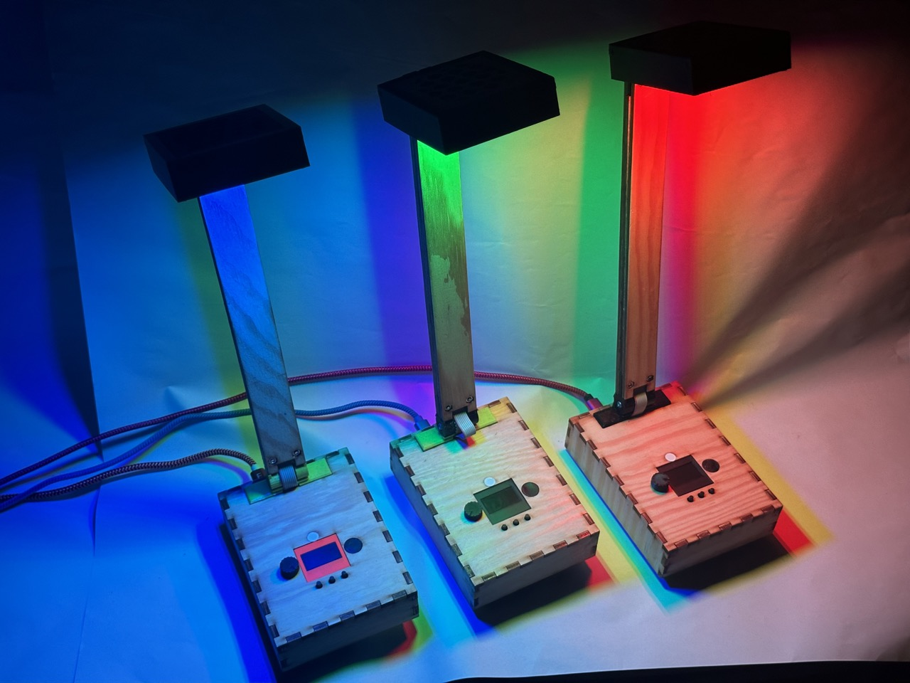
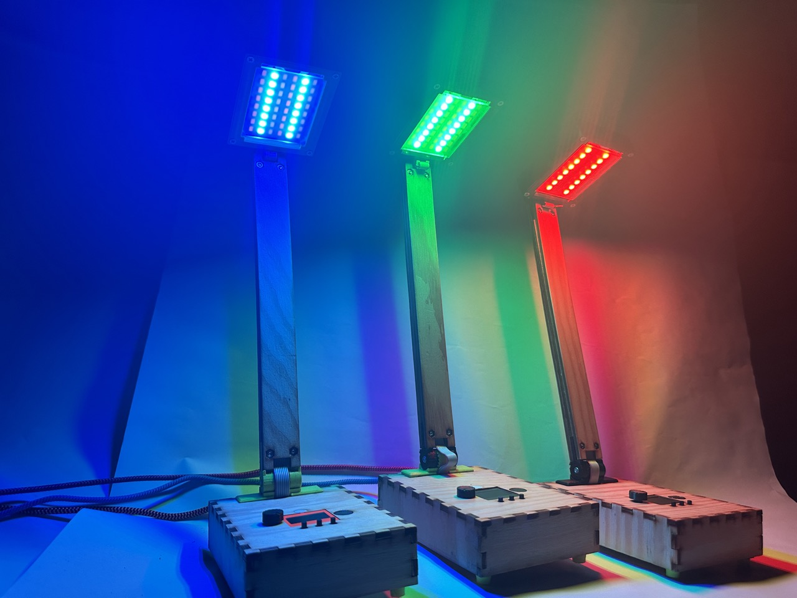
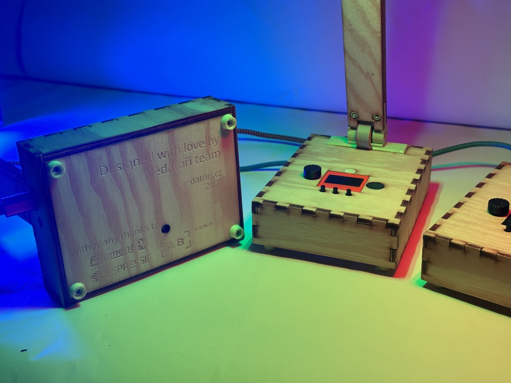
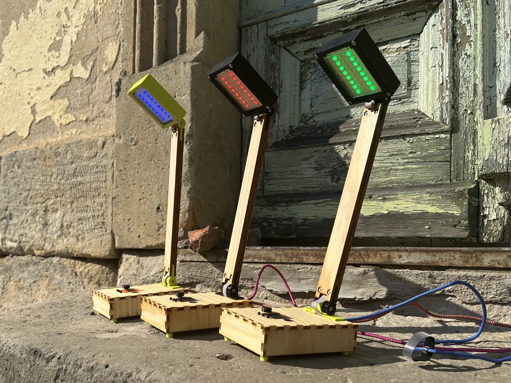

# PaLampa [cz]
PaLampa je chytrá stolní lampička navržená jako výrobek na Letní robotický tábor 2023 organizovaný spolkem [Vědátoři](vedatori.cz). 
Jedná se o výrobek speciálně vyvinutý tak, aby si na něm člověk mohl zlepšit dovednosti při nechanické stavbě, pájení a programování. 
Účastníci dostali tento výrobek jako stavebnici, kdy pájeli nestandardní součástky na DPS s předem osazenými SMD součástkami a z předem připravených dílů sestavili mechanickou část. 
Po finalizaci je možné výrobek programovat programování účastníků díky možnostem, které poskytují vsupní a výstupní periferie. 
Po finalizaci je možné výrobek programovat a díky množství vstupních a výstupních periferií si naprogramované funkcionality přehledně demonstrovat. 
Nakonec je výrobek možné použít jako chytrou a praktickou stolní lampičku. 

Mechanickou část lze rozdělit na dvě hlavní části - spodní krabici a horní lampu. Vnější části krabice jsou vyřezány z překližky na laserové řezačce a obsahují zámkové západky. 
Ty se při stavbě lepí disperzním lepidlem a po vyschnutí tvoří pevný základ pro uložení ostatních dílů. 
Základní díl horní lampy je vytisknutý na 3D tiskárně a světelný difuzor je vyřezán z plexiskla, které bylo následně zmatněno. 
Spojení osmiček a krabice zajišťuje 3D tištěný nosník umístěný uvnitř krabice, který také fixuje desky plošných spojů (DPS). 
Spojení krabice a lampy zajišťuje překližkový nosník napojený skrze ohebné kouby, kdy spodní kloub disponuje aretací v několika polohách. 

Hlavní DPS obsahuje zejména mikrokontroler ESP32, který je na ni připájen. Programování a napájení je zajištěno přes USB-C. 
Hlavní DPS obsahuje také tlačítka, dotyková tlačítka, potenciometr, fotorezistory, teplotní senzor, OLED grafickou obrazovku a bzučák. 
V lampě je vsazena DPS osazená LED světly svítícími teplou a studenou bílou, stejně jako řadou adresovatelných RGB LED. Další takové LED jsou umístěny zezadu na nosníku, kde zajišťují ambientní podsvětlení prostoru za výrobkem. 
Výrobek je rozebiratelný, jednotlivé DPS jsou spojeny konektory, vzdálenější periferie pomocí kabelů.

Všechny periferie byly zvoleny tak, aby vytvořily výrobek s mnoha volitelnými postranními funkcionalitami. 
Díky nim je možné u účastníků tábora rozvíjet jejich schopnost algoritmizovat úlohu a programovat. 
Pro hodiny byla vytvořena softwarová knihovna, která výrazně zjednodušuje interakci s periferiemi. 
Pomocí této knihovny byl vytvořen vzorový software, pomocí kterého je možné výrobek používat v základním nastavení. 
Výrobek je možné ovládat pomocí vstupních periferií nebo přes WiFi skrz počítač nebo smartphone, které přistupojí k interně hostované webové stránce. 
Všechny tyto vlastnosti lze upravovat a přidávat nové funkcionality podle přání uživatele. Zařízení se programuje ve Visual studio Code v jazyce C++ pomocí frameworku esp32-arduino.

Myšlenkou tohoto projektu je, aby výrobek tvořil každodenní užitečný doplněk pokoje, ale aby mohl být jeho software jednoduše modifikován a rozvíjen tak, jak si každý jeho vlastník představuje.

## Návod
Při stavbě hodin Time-O-Mat postupujte podle připravených návodů v následujícím pořadí:
1. [Návod pro elektroniku](https://github.com/Vedatori/PaLampa/blob/main/Manuals/PaLampa_electronics_cz.md)
1. [Návod pro mechaniku](https://github.com/Vedatori/PaLampa/blob/main/Manuals/PaLampa_mechanics_cz.md)
1. [Návod pro programování](https://github.com/Vedatori/PaLampa/blob/main/Manuals/PaLampa_programming_cz.md)
1. [Lekce na programování](https://github.com/Vedatori/PaLampa/blob/main/Manuals/PaLampa_lectures_achievements.md)

## Licence
* Obsah tohoto repozitáře mimo složku *Software* je sdílen pod licencí [Attribution-NonCommercial-ShareAlike 4.0 International (CC BY-NC-SA 4.0)](https://creativecommons.org/licenses/by-nc-sa/4.0/).
* Obsah složky *Software* je sdílen pod licencí [GNU Lesser General Public License v3.0](https://www.gnu.org/licenses/lgpl-3.0.en.html).

## License
* The contents of this repository excluding folder *Software* is shared under license [Attribution-NonCommercial-ShareAlike 4.0 International (CC BY-NC-SA 4.0)](https://creativecommons.org/licenses/by-nc-sa/4.0/).
* The contents of the folder *Software* is shared under license [GNU Lesser General Public License v3.0](https://www.gnu.org/licenses/lgpl-3.0.en.html).

